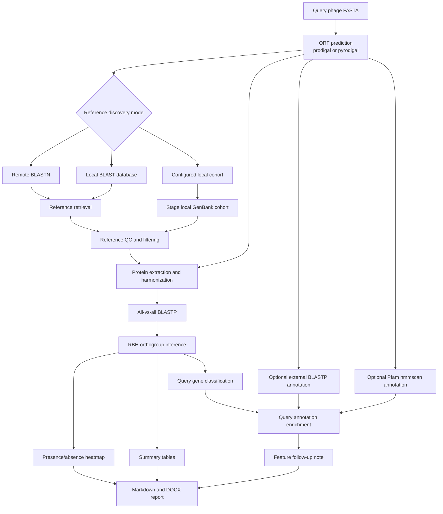

# Workflow Overview

## High-level flow

## Main outputs

- `orthology/summary.tsv`
- `orthology/presence_absence.tsv`
- `interpretation/query_gene_orthogroup_classification.tsv`
- `features/query_blastp_hits.tsv`
- `features/query_hmmscan_hits.tsv`
- `features/query_gene_annotations.tsv`
- `features/annotation_summary.tsv`
- `plots/pangenome_presence_absence_heatmap.png`
- `report/report.md`
- `report/report.docx`

## Supported discovery backends

- `blastn_remote`
- `local_blast_db`
- `configured`
